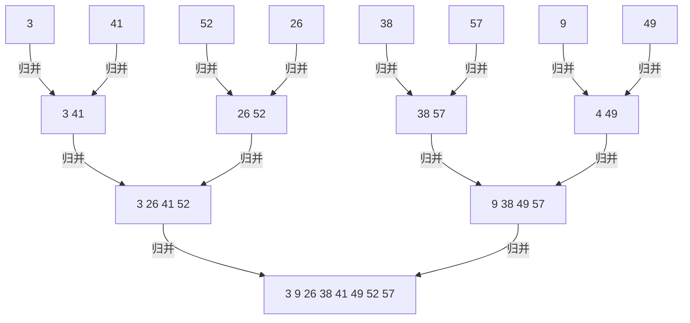

# 1算法导论习题集  


## 第一章  

### 1.1-1  

> 给出现实生活中需要排序的一个例子，和生活中需要计算凸壳的一个例子。  

* 排序：考试排名。
* 凸壳：计算城市的大小。  

### 1.1-2  

> 除速度外，在真实的环境中还可能使用哪些其他有关效率的度量？  

* 正确率，资源使用率，健壮性，支持并发数，内存占用等。

### 1.1-3

> 选择一种你以前已知的数据结构，并讨论其优势和局限。

* 链表
  - 优势：插入和删除非常快。
  - 局限：查找很慢。

### 1.1-4

> 前面给出的最短路径问题和旅行商问题有哪些相似之处，又有哪些不同？

* **相似**：都是在图中寻找最短的路径达到目的。
* **不同**：旅行商问题需要经过所有的点。

### 1.1-5

> 提供一个现实中的问题，其中只有最佳解才行。然后提供一个问题，其中近似最佳的一个解也足够好。

* 最小的孪生素数。
* 修复模糊图片。

### 1.2-1

> 给出在应用层面需要算法内容的应用的一个例子，并讨论设计的算法的功能。

* 查找出文本框中的敏感词。
* 匹配出文本中所有出现在敏感词库的词语。(DFA算法)

### 1.2-2

> 假设我们正比插入排序和归并排序在相同的机器上实现。对规模为$n$的输入，插入排序运行$8n^2$步，而归并排序运行$64n*lgn$步。问对于哪些$n$值，插入排序优于归并排序？

* 此处规模若为2 则 插入排序与归并排序无差别，此处不讨论这些情况。由于$8n^2 < 64n*lgn$为超越方程，编程求解。

* ```python
  from math import log
  
  for n in range(2,100):
      if(8*n*n > 64*n*log(n,2)):
          print(n-1)
          break
  ```

  > 输出：`43`

  $n <= 43$

### 1.2-3

> $n$最小为何值时，运行时间为$100n^2$的一个算法在相同机器上快于运行时间为$2^n$的另一个算法?

* 编程求解

* ```python
  for n in range(2,100):
      if(100*n*n < 2**n):
          print(n)
          break
  ```

  > 输出：`15`

  $n$最小为15 即 $n>=15$

### 1-1

> （运行时间的比较）假设求解问题的算法需要$f(n)$毫秒，对下表中的每一个函数$f(n)$和时间$t$，确定可以在时间$t$内求解的最大规模$n$。

|      | 1秒钟 | 1分钟 | 1小时 | 1天 | 1月 | 1年 | 1世纪 |
| :---: | :---: | :---: | :---: | :---: | :---: | :---: | :---: |
| $lgn$ | $2^{1000}$ |       |      |      |      | $2^{3.1536*10^{10}}$ | $\infty$ |
| $\sqrt{n}$ | $10^6$ |       |      |      |      |      |  |
| $n$ | 1000 |       | $3.6*10^6$ |      |      |      |  |
| $nlgn$ |       | 141 | 204095 |  |      |      |  |
| $n^2$ |       |       |      |      |      |      | 1775837 |
| $n^3$ |       |       |      |      |      |      | 14664 |
| $2^n$ | 9 | 15 | 21 | 26 | 31 | 34 | 41 |
| $n!$ |       |       |      |      |      |      | 15 |

* 其余不重要

## 第二章

### 2.2-1

> 以图2-2为模型，说明INSERTION-SORT在数组$A=<31, 41, 59, 26, 41, 58>$上的执行过程。

* 31 41 59分别通过检测，位置正确。 26 小于 31 -> {$A[0:2]=>A[1:3] and A[0]=26$}
* 数组变为$<26, 31, 41, 59, 41, 58>$
* $A[4]$中的41小于$A[3]$ 59 -> {$A[3]=>A[4] and A[3] = 41$ }
* 数组变为$<26, 31, 41, 41, 59, 58>$
* 同：数组变为 $<26, 31, 41, 41, 58, 59>$
* 完成

### 2.1-2

> 重写INSERTION-SORT使之按非升序(而不是非降序)排序。

```c++
#include <iostream>

template<typename T>
inline const bool UP(T a, T b) {
    return a > b;
}

template<typename _T>
void INSERTION_SORT(_T array[], int len, const bool (*cmp)(_T, _T)) {
    int j;
    _T tmp;
    for (int i = 1; i < len; i++) {
        tmp = array[i];
        j = i - 1;
        while (j >= 0 && cmp(tmp, array[j])) {
            array[j + 1] = array[j];
            j--;
        }
        array[j + 1] = tmp;
    }
}

int main() {
    using namespace std;
    int a[6] = {31, 41, 59, 26, 41, 58};

    INSERTION_SORT(a, 6, UP);

    for (int n : a) {
        cout << n << " ";
    }
    cout << endl;

    double b[6] = {31.5, 41.5, 59.5, 26.5, 41.5, 58.5};

    INSERTION_SORT(b, 6, up);

    for (double n : b) {
        cout << n << " ";
    }
    cout << endl;

    return 0;
}
```

> 输出 
>
> ```输出
> 59 58 41 41 31 26 
> 59.5 58.5 41.5 41.5 31.5 26.5
> 
> ```

### 2.1-3

> 考虑以下**查找问题**：
>
> **输入**: $n$个数的一个序列$A=<a_1, a_2, a_3, \ldots, a_n>$和一个值$v$。
>
> **输出**: 下标$i$使得$v=A[i]$或者当$v$不在$A$中出现时，$v$为特殊值$NIL$。
>
> 写出**线性查找**的伪代码，它扫描整个序列来查找$v$。使用一个循环不变式来证明你的算法是正确的。确保你的循环不变式满足三条必要的性质。

* ```伪代码
  Find(A, n) {
      for i = 0 to A.length {
          if A[i] == n{
              return i
          }
      }
      
      return NIL
  }
  ```

> * 初始化：在循环开始时 $A$数组$i$下标以前的元素都不等于$n$
>
> * 保持：在循环进行中 $A$数组$i$下标以前的元素都不等于$n$
>
> * 终止：$A$数组中的元素都不等于$n$或者 $A[i]=n$

### 2.1-4

> 有两个各存放在数组$A$和$B$中的$n$位二进制整数，考虑他们的相加问题。这两个整数的和存放在有$(n+1)$个元素的数组$C$中，请给出这个问题的形式化描述，并写出伪代码。

* ```伪代码
  set C = {0, ..., 0}
  for i = 0 to n {
  	tmp = A[i] + B[i] + C[i]
      C[i] = tmp%2
      C[i + 1] = tmp/2
  }
  ```

### 2.2-1

> 用$\Theta$记号表示函数$n^3/1000-100N^2-100n+3$

* $\Theta(n^3)$

### 2.2-2

> 考虑排序存储在数组$A$中的$n$个数：首先找出A中的最小元素并将其与$A[1]$中的元素交换。接着，找出$A$中的次小元素并将其与A[2]中的元素进行交换。对$A$中前$n-1$个元素继续这一过程。该算法称为选择算法，写出其伪代码，。该算法维持的循环不变式是什么？为什么它仅需要对前$n-1$个元素而不是对于所有n个元素运行？以$\Theta$记号给出选择排序的最佳运行时间和最坏运行时间。

* ```伪代码
  // 假定下标从 1 开始
  for i=1 to A.length {
      tmp = A[i]
      for j = i+1 to A.length {
          if(A[j] < tmp) {
              swap(A[j], tmp)
          }
      }
      A[i] = tmp
  }
  ```

> * 初始化：假定存在一个最小的前导元素$A[0]$ 则$A[i+1:A.length]$中的元素均小于$A[i]$。
>
> * 保持：$A[i+1:A.length]$ 找出最小元素 $A[j]$ 与$A[i]$交换 此时$A[i+1:A.length]$中的元素均小于$A[i]$。
>
> * 终止：任意$A[i]$小于$A[i+1:A.length]$排序完成。
>
> * 只对$n-1$个元素运行：循环不变式终止保证任意$A[i]$小于$A[i+1:A.length]$$i=n-1$时已经完成条件$A[n+1:n]$内无元素。
> * 最佳与最坏运行时间均为$\Theta(n^2)$

### 2.2-3

> 再次考虑线性查找问题。在平均情况下，需要检查输入序列中的多少个元素？假定待查找的元素是数组中的任何一个元素的可能性是相等的。在最坏情况下又怎样呢？用$\Theta$形式表示的话，线性查找的平均情况和最坏情况运行时间怎样？

* 最佳 $1$ 次，平均$n/2$次，最坏$n$次
* $\Theta(n)$

### 2.2-4

> 应如何修改一个算法使之具有良好的最好运行情况运行时间？
>
> 英文原文：How can we modify almost any algorithm to have a good best-case running time？
>
> 有翻译为：为什么不选用最佳运行情况运行时间作为算法运行时间的考量？

* 如题 2.2-3 对于任何规模的输入 最佳运行情况 均为$1$即只需一次运算，而其平均运行时间为 $n/2$

### 2.3-1

> 使用图2-4作为模型，说明归并排序在数组$A<3, 41, 52, 26, 38, 57, 9, 49>$上的操作。


### 2.3-2

> 重写MERGE，使之不用哨兵而是一旦是数组L或R的所有元素均被复制回到A就立刻停止操作，让后把另一个数组的剩余部分复制回A。

```C++
#include<iostream>

#define min(a, b) (a<b?a:b)

// 递归版
//template<typename _T>
//void merge_sort(_T arr[], int begin, int end) {
//    if (end - begin > 1) {
//        int mid = (int) ((end + begin) / 2);
//        merge_sort(arr, begin, mid);
//        merge_sort(arr, mid, end);
//        int begin2 = mid;
//        _T *tmp = (_T *) malloc(sizeof(_T) * (end - begin));
//        int k = 0;
//        while (begin < mid && begin2 < end) {
//            tmp[k++] = arr[begin] <= arr[begin2] ? arr[begin++] : arr[begin2++];
//        }
//
//        // 下面两个循环只有一个会进行
//        while (begin < mid) {
//            tmp[k++] = arr[begin++];
//        }
//        while (begin2 < end) {
//            tmp[k++] = arr[begin2++];
//        }
//        for (begin = end - k, k = 0; begin < end; begin++) {
//            arr[begin] = tmp[k++];
//        }
//        free(tmp);
//    }
//}

//迭代版
template <typename _T>
void merge_sort(_T arr[], int len) {
    _T *tmp = (_T *) malloc(sizeof(_T) * len);
    int size, start, i;//size当前归并的每个小组的大小,start和end为每次归并的始末
    for (size = 1; size < len; size *= 2) {
        for (start = 0; start < len; (start += size * 2)) {
            int k = start;

            //确定始末 防止出现元素被漏掉
            int begin1 = start, end1 = min(len, start + size);
            int begin2 = end1, end2 = min(len, begin2 + size);

            while (begin1 < end1 && begin2 < end2) {
                tmp[k++] = arr[begin1] <= arr[begin2] ? arr[begin1++] : arr[begin2++];
            }
            while (begin1 < end1) {
                tmp[k++] = arr[begin1++];
            }
            while (begin2 < end2) {
                tmp[k++] = arr[begin2++];
            }
            for (i = start; i < end2; i++) {
                arr[i] = tmp[i];
            }
        }
    }
    free(tmp);
}

int main() {
    using namespace std;
    int a[10] = {1, 6, 9, 8, 45, -10, 55, 2, 3, 96};
    merge_sort(a, 10);
    for (int it : a) {
        cout << it << " ";
    }
    cout << endl;
    double b[10] = {1.5, 6.5, 9.5, 8.5, 45.5, -10.5, 55.5, 2.5, 3.5, 96.5};
    merge_sort(b, 10);
    for (double it : b) {
        cout << it << " ";
    }
    cout << endl;

    return 0;
}
```

> 输出
>
> ```
> -10 1 2 3 6 8 9 45 55 96 
> -10.5 1.5 2.5 3.5 6.5 8.5 9.5 45.5 55.5 96.5
> 
> ```

### 2.3-3

> 使用数学归纳法证明：当$n$正好是$2$的幂时，以下的递归式的解是$T(n)=nlgn$。

$$
T(n)=\begin{cases}
2& \text{若$n=2$}\\[2ex] 
2T(n/2)+n& \text{若$n=2^k,k>1$}
\end{cases}
$$

$$
T(n)=2T(n/2)+n\\
其中\ 2T(n/2) = 4T(n/4) + n\\
即第k层为\ 2^kT(n/2^k) + n\\
\begin{CD}
    n/2^k = 2 \to k = lgn-1\\
\end{CD}\\
(lgn-1)*n+2*2^{lgn-1}=nlgn
$$

### 2.3-4

> 插入排序可以如下改写成一个递归过程：为排序$A[1 \ldots n]$，先递归地排序$A[1 \ldots n−1]$，然后再将$A[n]$插入到已排序的数组中去。对于插入排序的这一递归版本，为他的运行时间写一个递归式

$$
T(n)=\begin{cases}
1& \text{若$n=1$}\\[2ex] 
T(n-1) + 2n& \text{其它}
\end{cases}
$$

* $2n$ 考虑一次对比一次赋值

### 2.3-5

> A已排好序，写出二分查找的伪代码并证明其复杂度为$\Theta(lgn)$

```伪代码
// 数组从一开始
find(A, target) {
    begin = 1
    end = A.length
    where(end > begin) {
        mid = (begin + end)/2
        if A[mid] < target {
            end = mid - 1  
        } else if A[mid] > target {
            begin = mid + 1
        } else {
            return mid
        }
    }
    return -1
}


```

$$
T(n)=\begin{cases}
1& \text{若$n=1$}\\[2ex] 
T(n/2) + 1& \text{其它}
\end{cases}
$$

```
T(n)=2T(n/2)+n\\
其中\ 2T(n/2) = 4T(n/4) + n\\
即第k层为\ 2^kT(n/2^k) + n\\
\begin{CD}
    n/2^k = 2 \to k = lgn-1\\
\end{CD}\\
(lgn-1)*1+1=lgn
```

$$
T(n)=T(n/2)+1\\
其中\ T(n/2) = T(n/4) + 1\\
即第k层为\ T(n/2^k) + 1\\
\begin{CD}
    n/2^k = 2 \to k = lgn-1\\
\end{CD}\\
(lgn-1)*1+1=lgn
$$

### 2.3-6

> 使用二分查找 改进 2.1节 中的 INSERTION-SORT 的 5-7行 while可以将插入排序的最坏运行情况改进到$\Theta(nlgn)$吗？

* 无法 证明如下：

$$
T(n)=\begin{cases}
1& \text{若$n=1$}\\[2ex] 
T(n-1) + 2n& \text{其它}
\end{cases}\\
以上为插入排序的递归公式，对2n进行分析\\
2n=n+n
即n次对比n次移动（赋值） 利用二分 可将n次对比减少至lgn次\\
则改进后
T(n)=\begin{cases}
1& \text{若$n=1$}\\[2ex] 
T(n-1) + n + lgn& \text{其它}
\end{cases}\\
即 \sum_{i=0}^{n}lgi+i \to O(n^2)\\
$$

### *2.3-7

> 描述一个运行时间为$\Theta(nlgn)$的算法，给的$n$个整数的集合$S$和另一个整数$x$，该算法能确定$S$中是否存在两个其和刚好为$x$的元素。

* 快排/归并 + 二分 $\Theta(nlgn)$ 
* 第二中办法

```
S升序排序
i = 1
j = S.length
while i < j
	if S[i] + S[j] > x {
        j--
	} else if S[i] + S[j] < x {
        i++
	} else {
        return true
	}
return false
```

> 循环不变式证明
>
> * 初始化 和等于$x$两个元素必定在$i:j$中
> * 保持 若和过大则证明 $S[j]$ 过大，放弃$S[j]$，若存在 $k<i$使得$S[k] + S[j] = x$则$S[k]$不会因为过小而被放弃，即不存在这样的$k$则$S[j]$不满足题意，放弃。同理 若和过小则放弃$S[i]$
> * 终止 $S[i] + S[j] = x$ 或 $i==j$ 则 $S[i:j]$ 中只有一个元素，无法满足两个元素和等于$x$

### 2-1

> 大意：在归并快结束时利用插入排序使归并排序的递归树的末端变粗。
>
> 当归并的规模变为 $k$ 时 即有 $n/k$ 个子表时采用插入排序 来排序 这$n/k$个字表

> a. 证明插入排序可以在$\Theta(nk)$时间内排序这$n/k$​个长度为$k$的子表。

* 插入排序时间复杂度为$\Theta(n^2)$ 则$n/k$个规模为$k$的子表需要$k^2*n/k=nk$

> b. 表明在最坏的情况下如何在$\Theta(nlg(n/k))$时间内合并这些子表。

* 插入排序的工作交给归并排序需要 $n/k*(k*lgk)=nlgk$ 而归并排序做完全部工作需要$nlgn$，做差得$n(lg(n)-lg(k))=nlg(n/k)$

> c. 假定修改后的算法的最坏情况运行时间为$\Theta(nk+nlg(n/k))$，要使修改后的算法与标准的归并排序具有相同的运行时间，k的最大值是什么

* $\Theta(k+lg(n/k)) <= \Theta(lgn) \to \Theta(k+lgn-lgk)) <= \Theta(lgn) \to k<=lgn$

> d.在实践中如何选取k。

* 实践中通过实验得到真理即可。

### 2-2

> 大意：冒泡排序的证明与分析运行下列代码后$A^{'}[1]\le A^{'}[2]\le \ldots \le A^{'}[n]$成立
>
> ```伪代码
> for i = 1 to A.length - 1 {
>     for j = A.length downto i+1 {
>         if A[j] < A[j - 1] {
>             swap A[j] with A[j-1]
>         }
>     }
> }
> ```
>
> 其中$n=A.length$
>
> a，b，c同时证明，分析两个循环不变式

* 先证明2到6行

>初始化：$j=A.length$，若$A[j]<A[j-1]$，交换其值，则$A[j-1]$不大于其右边的其他数
>
>保持：若$A[j]<A[j-1]$，交换其值，$A[j-1] \le A[j]$，$A[j-1]$不大于其右边的其他数，$j \to j-1$
>
>终止：$j=i-1$，$a[j] 即 a[i-1]$ 不大于其右边的其他数

* 再证明1到7行

>初始化：设有一个无限小数，在不存在的A[0]中，此时$i=1\ and\ A[i-1]$不大于$A[i:A.length]$中任何数。
>
>保持：由2-6行，此时$A[i-1]$不大于$A[i:A.length]$中任何数。
>
>终止：$i=A.length-1$，此时任何一个$A[i-1] \le A[i:A.length]$成立，即$A[i] \le A[i-1]$成立

> d. 冒泡排序运行时间，对比插入排序如何？

* 运行时间和插入排序一致为$\Theta(n^2)$，插入排序的递归式计算结果（最坏情况）为$(n+1)*n/2 * 2+n \to n^2 $ 而冒泡排序为$(n+1)*n/2*3 -> 1.5n^2$，其中插入排序中的$*2$为一次比较一次位移，$+n$为$n$次插入可忽略，冒泡排序中$*3$为一次比较一次交换（交换至少三次运算）所以插入排序优于冒泡排序。

### 2-3

> 给定系数$a_0, a_1, \ldots , a_n$和$x$的值，代码片段
>
> ```伪代码
> y = 0
> for i = n downto 0 {
>     y = a_i + x*y
> }
> ```
>
> 实现了求值多项式
> $$
> P(x) = \sum_{k=0}^na_kx^k = a_0 + x(a_1+x(a_2+\ldots+x(a_{n-1}+xa_n)\ldots))
> $$
> 的霍纳规则。

> a. 运行时间

* $\Theta(n)$

> b. 朴素方法求值，运行时间时多少？对比霍纳规则，其性能如何？

* $\Theta(n^2)$  性能差距非常大，指数级的差距

> c. 在for循环每次迭代的开始有
> $$
> y=\sum_{k=0}^{n-(i+1)}a_{k+i+1}x^k
> $$
> 把没有项的和式解释为0。给出循环不变式证明终止时有$y=\sum_{k=0}^na_kx^k$。
>
> 初始：不存在和式，即$y=0$。
>
> 保持：每次开始时，$y=\sum_{k=0}^{n-(i+1)}a_{k+i+1}x^k$。
>
> 终止：$y = (\sum_{k=0}^{n-1}a_{k+1}x^k)*x+a_0 = y=\sum_{k=0}^na_kx^k$

> d. 证明上面的代码是正确的。

* 对于任意 $a_m$ 在循环变量$i > m$时$a_m$项还未出现，对和的贡献为0，在$i \le m$时，对和的贡献为$a_m*x^{m-i}$，即当$i=0$时，$a_m$的贡献为$a_m*x^m$，显然，$a_0 \ldots a_n$均如此，用数学语言描述，即为$\sum_{k=0}^na_kx^k$

### 2-4

> 大意：$A[1:n]$数组中称$i<j\ and\ A[i]>A[j]$这样的$(i,j)$为A的一个逆序对。

> a. 列出数组$<2, 3, 8 , 6, 1>$中的5个逆序对。

* $(1,5) (2,5) (3,4) (3,5) (4,5)$

> b. $A[1:n]$中的元素构成什么数组时逆序对最多，为多少？

* 降序排序 $n^2/2$

> c. 插入排序的运行时间和逆序对之间有什么关系，请证明你的回答。

* > 运行时间和逆序对数量成正比例。对于第10页插入排序的伪代码的5-7行，即
  >
  > ```伪代码
  > while i > 0 and A[i] > key
  > 	A[i+1] = A[i]
  > 	i = i - 1
  > ```
  >
  > 进行分析。
  >
  > 首先，由于插入排序的特性$A[1:i]$已经排好序，并且$A[1:i]$的元素只有顺序变化，不影响$i+1$与其形成逆序对的总数，则：
  >
  > 若 $A[k] \le A[i]$ 则对于任意$0 \le x \le k$有$A[x] \le A[i]$
  >
  > 则该循环运行的次数就是$i+1$与$1:i$之间的逆序对的整数，为原始数组中逆序对$(x,i) \text (x为未知变量)$的总数。
  >
  > 推广可知，插入排序运行的次数与$\sum_{i=0}^{A.length} (数组逆序对中(x,i) \text (x为未知变量)总数)$即该数组逆序对总数成正比。
  >
  > 证毕

> 给出确定任意数组逆序对的算法(提示，修改归并算法)。

* 思路：归并每一次对比都可以确定这一些数是否逆序数(右数组先复制过来时，左数组剩下的数的个数即为右数组在该子表内的逆序数个数，并且之后不会重复计算)，只需要在排序中增加一个计数器。

```C++
#include<iostream>

#define min(a, b) (a<b?a:b)

template <typename _T>
int inversion(_T arr[], int len) {
    int count = 0;
    _T *tmp = (_T *) malloc(sizeof(_T) * len);
    _T *_arr = (_T *) malloc(sizeof(_T) * len);
    for(_T t = 0; t < len; t++) {
        _arr[t] = arr[t];
    }
    int size, start, i;//size当前归并的每个小组的大小,start和end为每次归并的始末
    for (size = 1; size < len; size *= 2) {
        for (start = 0; start < len; (start += size * 2)) {
            int k = start;

            //确定始末 防止出现元素被漏掉
            int begin1 = start, end1 = min(len, start + size);
            int begin2 = end1, end2 = min(len, begin2 + size);

            while (begin1 < end1 && begin2 < end2) {
                if( _arr[begin1] <= _arr[begin2] ) {
                    tmp[k++] = _arr[begin1++];
                } else {
                    tmp[k++] = _arr[begin2++];
                    count += end1 - begin1;
                }
            }
            while (begin1 < end1) {
                tmp[k++] = _arr[begin1++];
            }
            while (begin2 < end2) {
                tmp[k++] = _arr[begin2++];
            }
            for (i = start; i < end2; i++) {
                _arr[i] = tmp[i];
            }
        }
    }
    free(tmp);
    free(_arr);

    return count;
}

int main() {
    using namespace std;
    int a[10] = {1, 6, 9, 8, 45, -10, 55, 2, 3, 96};
    cout << inversion(a, 10) << endl;
    int b[5] = {2, 3, 8, 6, 1};
    cout << inversion(b, 5) << endl;
    return 0;
}
```

>输出
>
>```输出
>16
>5
>```

## 第三章

### 3.1-1

> 假设$f(n)$与$g(n)$都是渐进非负函数。使用$\Theta$记号的基本定义来证明$max(f(n),g(n))=\Theta (f(n)+g(n))$

* $$
  设f(n) \ge g(n)\\
  \because F(n) = f(n) + g(n)\\
  又\because f(n) \ge 0\ and\ g(n) \ge 0\\
  \therefore2f(n) \ge F(n) \ge f(n) \ge 0\\
  max(f(n),g(n)) = f(n)\\
  对任意n \gt 0存在c_1 = 0.5, c_2 = 1\\
  0 \le c_1F(n) \le f(n) \le c_2F(n)\\
  此时满足 f(n)=\theta (f(n)+g(n))\\
  f(n) \le g(n) 同理\\
  则 max(f(n),g(n))=\theta (f(n)+g(n))\\
  证毕
  $$

### 3.1-2

> 证明：对任意实常量$a$和$b$，其中$b \gt 0$，有
> $$
> (n+a)^b = \theta(n^b)
> $$

* $$
  \lim_{n \to \infty} \frac{(n+a)^b}{n^b} = 1\\
  (n+a)^b = O(n^b)\\
  必然：(n+a)^b = \theta(n^b)
  $$

### 3.1-3

> 解释为什么“算法$A$的运行时间至少是$O(n^2)$”这一表述是无意义的。

* $O(n^2)$并不表示一个具体的数值，对于特定的$n$，$O(n^2)$可以是任意值。

### 3.1-4

> $2^{n+1}=O(2^n)\ and\ 2^{2n}=O(2^n)$成立吗？

* 对于 $2^{n+1}=O(2^n)$，显然成立。
* 对于 $2^{2n}=O(2^n)$

$$
\lim_{n \to \infty}\frac{2^{2n}}{2^n} = \infty\\
2^{2n}=O(2^n)不成立
$$

### 3.1-5

> 证明定理3.1。

> 定理3.1 对于任意两个函数$f(n)$和$g(n)$，我们有$f(n)=\Theta(g(n))$，当且仅当$f(n)=O(g(n)) 且 f(n)=\Omega(g(n))$。

* $$
  \because f(n)=O(g(n))\\
  存在一个X，对于所有 n \ge X有\ \exists{(c_1)}(f(n) \le c_1g(n))成立\\
  \because f(n)=\Omega(g(n))\\
  存在一个Y，对于所有 n \ge Y有\ \exists{(c_2)}(f(n) \ge c_2g(n))成立\\
  即存在一个Z = MAX(X,Y), 对于所有 n \ge Z有\\
  \exists{(c_2)}(c_1g(n) \ge f(n) \ge c_2g(n))成立\\
  \therefore f(n) = \Theta(g(n))\\
  显然逆推成立
  $$

### 3.1-6

> 题目表述与3.1-5略有不同，解答几乎同上。

### 3.1-7

> 证明：$o(g(n)) \cap \omega(g(n))$为空集。

$$
设存在f(n) = o(g(n))\ and\ f(n) = \omega(g(n))\\
则有 \forall(c_1)(f(n) \lt c_1g(n))\ and\ \forall(c_2)(f(n) \gt c_2g(n))\\
明显矛盾，则不存在样的f(n)\\
o(g(n)) \cap \omega(g(n)) = \emptyset
$$

### 3.1-8

> 若对于给定的$g(n,m)$有：
> $$
> O(g(n,m))=\{f(n,m).存在正常量c,n_0和m_0，使得对所有n \ge n_0或 m \ge m_0，\\
> 有0 \ge f(n,m) \ge cg(n,m)\}
> $$
> 对$\Omega(g(n,m))$和$\Theta(g(n,m))$给出相应定义。
>
> > 此处英文原题：
> >
> > We can extend our notation to the case of two parameters n and m that can go to
> > infinity independently at different rates. For a given function $g(n,m)$, we denote
> > by $O(n,m)$ the set of functions
> > $$
> > O(g(n,m))=\{f(n,m):there\ exist\ positive\ constants\ c,n_0\ and\ m_0，\\
> > such\ that\ 0 \le f(n,m) \le cg(n,m)\\
> > for\ all\ n \ge n_0\ or\ m \ge m_0\}.
> > $$
> > 
> >
> > Give corresponding definitions for $\Omega(g(n,m))$ and $\Theta(g(n,m))$.

$$
\Omega(g(n,m))=\{f(n,m).存在正常量c,n_0和m_0，使得对所有n \ge n_0或 m \ge m_0，\\
  有f(n,m) \le cg(n,m)\}
$$

$$
\Theta(g(n,m))=\{f(n,m).存在正常量c_1,c_2,n_0和m_0，使得对所有n \ge n_0或 m \ge m_0，\\
  有c_1g(n,m) \le f(n,m) \le c_2g(n,m)\}
$$

* 注：以上$n \ge n_0或 m \ge m_0$中连接词均为或，若为且，则会存在：

$$
以下只讨论原题情况，其他类似\\
若为\\
O(g(n,m))=\{f(n,m).存在正常量c,n_0和m_0，使得对所有n \ge n_0且 m \ge m_0，\\
有0 \ge f(n,m) \ge cg(n,m)\}\\
具体化该描述为\\
O(g(n,m))=\{f(n,m).存在正常量c=1，使得对所有n \ge 2且 m \ge 5，\\
有0 \ge f(n,m) \ge cg(n,m)\}\\
则 f(1,10000) = \infty \gt cg(n,m)\ 符合上述描述\\
但cg(n,m)并非f(n,m)的渐进上界
$$

### 3.2-1

>  若$f(n)$单增且$g(n)$单增，证明$f(n)+g(n)\ and\ f(g(n))$单增。此外，若$f(n)>0\ and\ g(n) > 0$，则$f(n)*g(n)$单增。

$$
f(n)-f(n-1)>0\\
g(n)-g(n-1)>0\\
(f(n)+g(n))-(f(n-1)+(g(n-1)))>0\\
各种同理，证明完毕
$$


### 3.2-2

> 证明 $a^{log_bc}=c^{log_ba}$。

$$
a=d^{m_1}\ and\ c = d^{m_2}\\
原式可化为：d^{m_1log_bd^{m_2}} = d^{m_2log_bd^{m_1}}\\
d^{m_1*m_2log_bd} = d^{m_2*m_1log_bd}\\
显然成立
$$

### 3.2-3

> 证明 $lg(n!)=\Theta(nlgn)\ and\ n!=\omega(2^n)\ and\ n!=o(n^n)$。

$$
lg(n!) = \sum_{i=0}^nlgi le nlgn\\
由斯特林公式\ n!\approx \sqrt{2\pi n}(\frac{n}{e})^n = \sqrt{2\pi n}e^{-n}n^n\\
lg(n!) \approx lg(\sqrt{2\pi n}e^{-n}n^n) = nlg(\frac{\sqrt[2n]{2\pi n}}{e}n)\\
\lim_{n \to \infty}\sqrt[2n]{2\pi n} = 1\\
lg(n!) \approx nlg(\frac{n}{e}) = nlgn - nlge\\
当 n \ge e^2时 nlgn - nlge \ge \frac{1}{2}nlgn\\
即当 n \ge e^2 时 存在 c_1=0.5\ c_2=1\ 使得\\
c_1(nlgn) \le lg(n!) \le c_2(nlgn)\\
lg(n!) = \Theta(nlgn)\\
当n > 4时，显然有 n! > 2^n\\
n!=\omega(2^n)\\
\lim_{n \to \infty} \frac{n!}{n^n} = \frac{1}{n}*\frac{2}{n}*\ldots*\frac{n-1}{n}*1 = 0\\
n!=o(n^n)
$$

### 3.2-4

> $\lceil lgn \rceil!$多项式有界吗？$\lceil lglgn \rceil!$多项式有界吗？

$$
\text 多项式有界是指存在k有\ f(n) = O(n^k) \\
两边同时取2的对数\\
lg(f(n)) = klgcn = klgc + klgn\\
即 lg(f(n)) = O(lgn)\\
lg(n!) = \Theta(nlgn)\\
设 lg(n!) \ge c_1nlgn \\
------\\
f(n) = \lceil lgn \rceil!\\
显然地\ lg(\lceil lgn \rceil!) 为单增函数，无上界。\\
若存在c 使\ lg(\lceil lgn \rceil!)\le clgn 成立\\
必定存在n\ 使得 c_1lg\lceil lgn \rceil \ge c 时\\
lg(\lceil lgn \rceil!)=c_1\lceil lgn \rceil lg\lceil lgn \rceil > clgn\\
则不存在这样的c，不是多项式有界\\
=========\\
f(n) = \lceil lglgn \rceil!\\
要证 lg(\lceil lglgn \rceil!) = O(lgn)\\
\begin{align}
\lim_{n \to \infty}\frac{lg(\lceil lglgn \rceil!)}{lgn} 
& \approx \lim_{n \to \infty}\frac{lg(\sqrt{2\pi\lceil lglgn \rceil}(\frac{\lceil lglgn \rceil}{e})^{\lceil lglgn \rceil})}{lgn}\\
& = \lim_{n \to \infty}\frac{lg(\sqrt{2\pi\lceil lglgn \rceil})+\lceil lglgn \rceil lg(\frac{\lceil lglgn \rceil}{e})}{lgn}\\
& = \lim_{n \to \infty}lglgn\frac{lg(\lceil lglgn \rceil)-lge}{lgn}\\
& = \lim_{n \to \infty}lglgn\frac{lg(\lceil lglgn \rceil)}{lgn}\\
& = \lim_{n \to \infty}lglgn\frac{lglglgn}{lgn}\\
\end{align}\\
设p = lgn\ q = lgp\\
\lim_{n \to \infty}lglgn\frac{lglglgn}{lgn} = \lim_{n \to \infty}\frac{qlgq}{2^q} = 0\\
明显\ lg(\lceil lglgn \rceil!) = O(lgn)\\
多项式有界
$$

### 3.2-5

> 代入法(代入大数)得到 $lg(lg^*n)$ 渐近 小于 $lg^*(lgn)$。

### 3.2-6

> 

