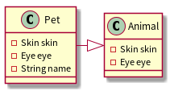
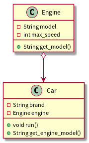
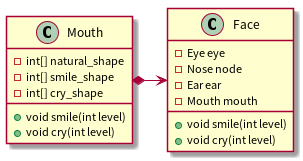
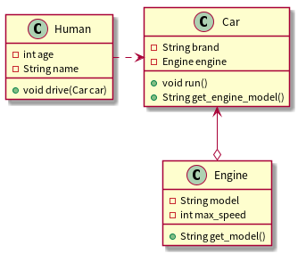

# UML类图

* 类图可以使系统结构变得更加清晰可见

## 类图识别

### 单个类

* 一个类表示为一个框，三行分别是类名、成员变量、成员方法。
* 其中成员变量和成员方法的访问修饰符用\+-#\~/。\+表示public，-表示private，#表示protected，某些语言如java中的default使用~表示。/为无具体值(可能有些情况不属于前四种，没有见过类似的东西)。    

##  多个类

* 继承关系。空心箭头[实线|虚线]，父类为接口时使用虚线。

* 如图为聚合关系，部分组成整体，部分可脱离整体而存在。使用空心菱形实线箭头表示，箭头指向整体。

* 如图为合成关系，部分组成整体，部分属于整体。实心菱形+实线+箭头，箭头指向整体。

* 依赖关系为虚线箭头，箭头指向被依赖一方。依赖关系为，没有被依赖方(Car)，依赖方(Human)某些行为无法正常运行。

* 关联关系，双向关联为实线(无首尾箭头)，单向关联为实线箭头。这是一种弱关系，如人->杂志。
